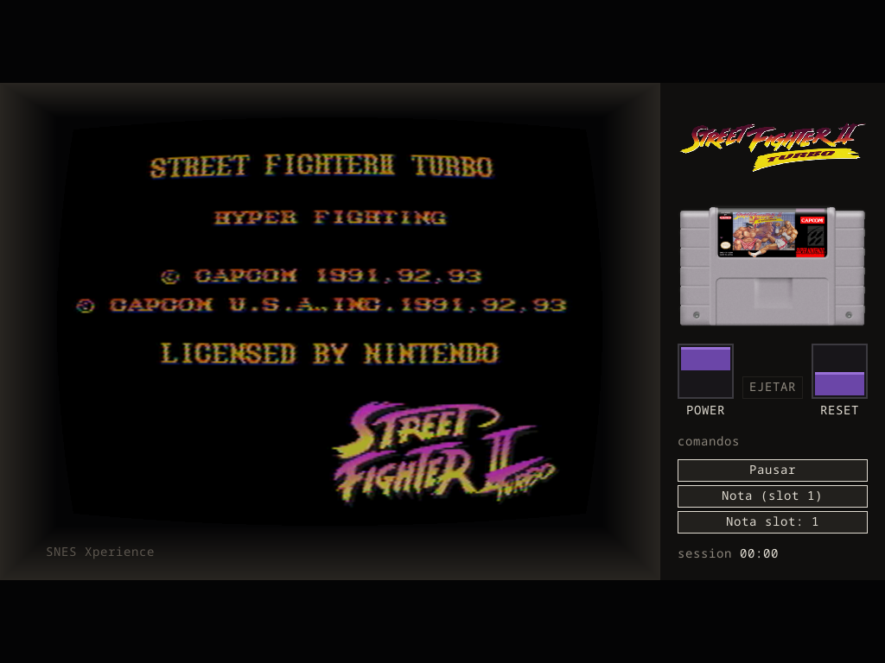
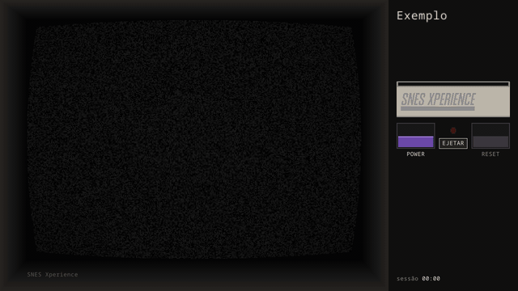
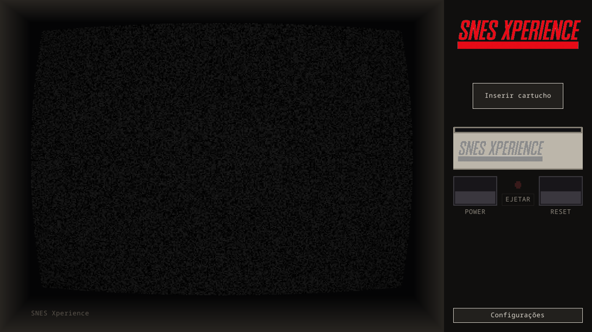

# SNES Xperience

Emulador de SNES portátil com um console inteiro desenhado na tela —
gabinete, tubo CRT e painel de controle de verdade — em vez de só uma
janela com o jogo. Projeto pessoal, sem fins comerciais.



## Como funciona

- **Escolher um jogo insere o cartucho de verdade**: a tela inicial é o
  console com o slot vazio e um botão "Inserir cartucho"; o jogo entra na
  estante, o cartucho desce e assenta no slot (gif abaixo), e o console só
  liga quando você clicar em Power — igual ao hardware.
- **Cartucho entra e sai com animação** no painel, com clique de encaixe e
  de destravamento:



- **Painel de console de verdade**: logo e back cover do jogo, chaves
  Power/Reset roxas (Power retoma de onde parou; Reset é momentâneo) e
  Ejetar, que só solta o cartucho com o console desligado.
- **Tubo CRT de verdade**: filtro NTSC RF, tela cheia por padrão
  (desligável) usando a resolução nativa do monitor em 16:10/16:9 (Steam
  Deck, laptops, TVs) e botão de fechar no canto — sem barra de título.
- **Estante com busca, "jogados recentemente" e histórico**, com tempo de
  jogo por jogo (só contando com o console ligado) e por sessão.
- **Ano e editora de fábrica, sem DAT nenhum**: tabela embutida no binário
  (derivada do [TOSEC](https://www.tosecdev.org/)); um DAT
  [No-Intro](https://datomatic.no-intro.org/) local tem prioridade quando
  concorda, e um botão em Configurações renomeia as ROMs para o padrão
  No-Intro movendo save/anotação/arte junto.
- **Anotações**: pausa o jogo e abre um livro de duas páginas — cheats
  curados ligados por checklist, nota de texto livre e 15 slots de captura
  de tela fixáveis e nomeáveis. Printscreen/Salvar/Carregar abrem modais
  próprios.
- **Só mouse e gamepad** para tudo; a única exceção é escrever uma
  anotação, que precisa de teclado por natureza.
- **Portátil, sem banco de dados e sem raspagem online**: tudo em pastas
  ao lado do executável (`roms/`, `core/`, `assets/`, `saves/`, `notes/`)
  — capa, logo, cartucho, contracapa e o wordmark do console
  (`console-tag.png`) vêm de imagens suas; o core snes9x baixa sozinho pelo
  menu de configurações.



## Baixar

Pacotes prontos — DMG (macOS), zip com os `.exe` (Windows), AppImage
(Linux), todos com SDL3 já embutido — saem automático a cada release, na
aba [Releases](https://github.com/ticianocorral/snes-xperience/releases).

## Jogar

Na primeira execução o app cria sozinho as pastas em `~/Documents/SNES
Xperience` (no macOS; no Windows/Linux, ao lado do executável). Coloque
suas ROMs em `roms/` e o core do snes9x em `core/` — ou baixe-o direto
pelo menu de configurações.

```bash
cargo run --bin xperience
```

Clique em "Inserir cartucho" para abrir a estante. Solte um
`<nome-da-rom>.png` (mesmo nome do arquivo, sem extensão) em
`assets/{cover,logo,cartridge,backcover}/` para dar arte a um jogo — capas
são desenhadas em paisagem. Um `nointro.dat` (DAT XML do No-Intro) na raiz
do app dá o nome canônico dos jogos — opcional, baixe você mesmo.

## Compilar

Precisa de Rust estável e do SDL3.

```bash
brew install sdl3   # macOS
cargo build && cargo test
```

Sem SDL3 no sistema, compile-o junto (precisa de CMake + toolchain C):

```bash
cargo build --features xperience-platform/vendored-sdl
```

`emu-run` roda uma ROM solta sem o resto do app:

```bash
cargo run --bin emu-run -- --core caminho/snes9x_libretro.dylib --rom jogo.sfc
```

Nenhum core ou ROM é distribuído com o projeto — ver
[`THIRD-PARTY-NOTICES.md`](THIRD-PARTY-NOTICES.md).

## Arquitetura

Quatro camadas, dependências só para baixo:

| Camada       | Crate                 | Responsabilidade                                                        |
| ------------ | --------------------- | ----------------------------------------------------------------------- |
| Apresentação | `xperience-app`       | binários (`xperience`, `emu-run`, `selector`) + `runner`/`shelf`/`settings` |
| Domínio      | `xperience-domain`    | identificação de ROM, catálogo (JSON), DAT No-Intro, TOSEC               |
| Emulação     | `xperience-emulation` | core libretro carregado em runtime, laço de execução                     |
| Plataforma   | `xperience-platform`  | SDL3: o `Cabinet` (gabinete, tubo CRT, painel), áudio, gamepad           |

`xperience-ntsc` é um crate folha à parte (o `snes_ntsc` do blargg,
vendorizado). Para o histórico completo de implementação, ver
[`docs/plano-emulador-moldura.md`](docs/plano-emulador-moldura.md) e
`docs/fase-0.md` … `docs/fase-4.md`.

## Versionamento e licenças

[SemVer 2.0.0](https://semver.org/lang/pt-BR/): todo o workspace
compartilha uma versão (`[workspace.package]` em `Cargo.toml`), cada
release é uma tag `vX.Y.Z` e um item no
[`CHANGELOG.md`](CHANGELOG.md). Licenças de terceiros em
[`THIRD-PARTY-NOTICES.md`](THIRD-PARTY-NOTICES.md).
